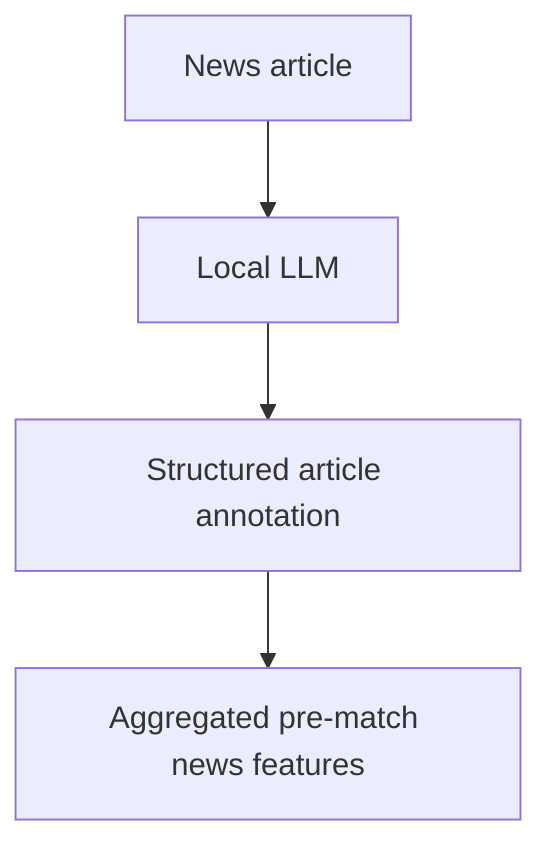
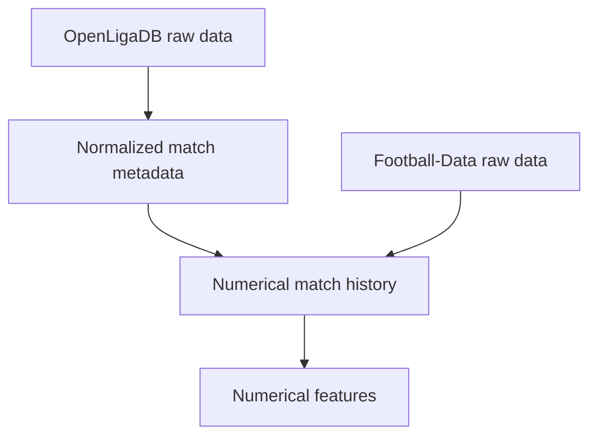
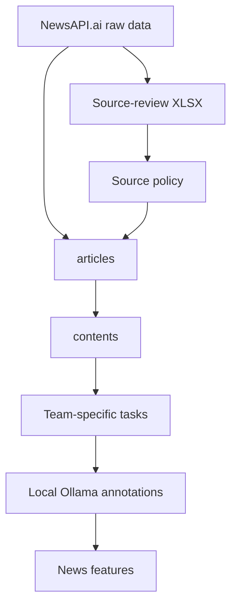
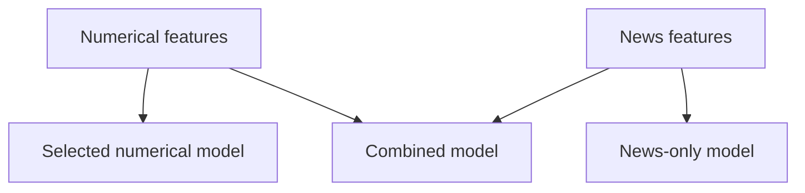

# bundesliga-news-prediction

Python pipeline for a master's thesis investigating whether pre-match sports
news contains predictive information about Bundesliga match outcomes, whether
structured news features improve predictions beyond numerical pre-match data
alone, and how suitable local large language models (LLMs) are for extracting
this information.

## Contents

- [Current Scope](#current-scope)
- [Experiment Design](#experiment-design)
- [Data Flow](#data-flow)
- [Setup](#setup)
- [Numerical Data Pipeline](#numerical-data-pipeline)
  - [1. Fetch OpenLigaDB Match Data](#1-fetch-openligadb-match-data)
  - [2. Fetch Football-Data Match Statistics](#2-fetch-football-data-match-statistics)
  - [3. Build Normalized OpenLigaDB Matches](#3-build-normalized-openligadb-matches)
  - [4. Build Numerical Match History](#4-build-numerical-match-history)
  - [5. Build Numerical Features](#5-build-numerical-features)
- [News Pipeline](#news-pipeline)
  - [6. Build Planned News Requests](#6-build-planned-news-requests)
  - [7. Fetch News Responses](#7-fetch-news-responses)
  - [8. Export Sources for Manual Legal Review](#8-export-sources-for-manual-legal-review)
  - [9. Build Reviewed News Source Policy](#9-build-reviewed-news-source-policy)
  - [10. Build Policy-Filtered News Articles](#10-build-policy-filtered-news-articles)
  - [11. Build News Contents](#11-build-news-contents)
  - [12. Build Team-Specific LLM Annotation Tasks](#12-build-team-specific-llm-annotation-tasks)
  - [13. Annotate News Through Local Ollama](#13-annotate-news-through-local-ollama)
  - [14. Build News Features](#14-build-news-features)
- [Modelling](#modelling)
  - [15. Evaluate ZeroR Baseline](#15-evaluate-zeror-baseline)
  - [16. Evaluate Full-Feature Numerical Reference](#16-evaluate-full-feature-numerical-reference)
  - [17. Select Numerical Model Configuration](#17-select-numerical-model-configuration)
  - [18. Evaluate Selected Numerical Model](#18-evaluate-selected-numerical-model)
  - [19. Evaluate News-Only Model](#19-evaluate-news-only-model)
  - [20. Evaluate Combined Model](#20-evaluate-combined-model)
- [Analysis Notebooks](#analysis-notebooks)
  - [Model Comparison Notebook](#model-comparison-notebook)
  - [Annotation Reproducibility Notebook](#annotation-reproducibility-notebook)
  - [Annotation Bias Notebook](#annotation-bias-notebook)
  - [News Feature Ablation Notebook](#news-feature-ablation-notebook)

## Current Scope

The implemented pipeline currently supports:

1. downloading raw Bundesliga match metadata from OpenLigaDB
2. downloading raw match statistics from Football-Data.co.uk
3. normalizing OpenLigaDB match metadata
4. joining both match sources into a numerical match history
5. calculating numerical pre-match features
6. planning German pre-match news requests for Event Registry / NewsAPI.ai
7. fetching the planned news requests
8. exporting collected source homepages into a workbook for manual legal review
9. converting the reviewed news-source XLSX into a JSON policy
10. applying the source policy and building articles
11. grouping text-identical publications under stable content IDs
12. building request-bound, team-specific local-LLM annotation tasks
13. extracting four structured news indicators through a local Ollama server
    with a versioned system prompt and strict JSON output
14. aggregating the validated annotations into 16 match-level home/away news
    features
15. evaluating the **ZeroR baseline** with a `DummyClassifier`
16. evaluating standardized multinomial logistic regression on the numerical
    features
17. selecting numerical logistic-regression regularization and one of two fixed
    feature sets with training-only expanding-window validation
18. evaluating the **Selected numerical model** on the
    fixed test split without overwriting the original baseline
19. evaluating the supplementary **News-only model** using only the
    16 fixed news features
20. evaluating the **Combined model** with that same
    configuration, the selected 31 numerical features, and all 16 fixed news
    features

All experiment variants are evaluated on the same fixed test matches.

Four notebooks provide additional analyses:

1. **Model comparison** compares the predictive performance of the four models
   on the same test matches.
2. **Annotation reproducibility** examines how consistently the local LLM
   annotates the same news in two runs.
3. **Annotation bias** explores possible bias in the LLM annotations through
   indicator and team comparisons and comparison with human annotations.
4. **News-feature ablation** examines how different groups of news features
   contribute to predictive performance when added to the numerical model.

## Experiment Design

The main experiment compares two variants on exactly the same matches:

1. numerical pre-match features only
2. the same numerical features plus aggregated news features extracted by a
   local LLM

The target classes are:

```text
H = home win
D = draw
A = away win
```

The fixed split for season 2025/26 is:

```text
Training: matchdays 1-27 (243 matches)
Test:     matchdays 28-34 (63 matches)
```

The **ZeroR baseline** is implemented with
`DummyClassifier(strategy="prior")`, the other models use multinomial logistic
regression. Evaluation uses Log Loss, Accuracy, Macro-F1, Brier
Score, and a Confusion Matrix.

The local LLM acts as a feature extractor, not as the match predictor:



## Data Flow

### Numerical Data



### News



### Models



Data and results are organized into five directories:

- `data/raw`: unchanged match and news data from external sources
- `data/interim`: intermediate data, including prepared match data, news
  requests, processed articles, and LLM annotations
- `data/processed`: numerical and news feature tables for modeling
- `data/review`: workbook for manual review of news sources
- `outputs`: model evaluation reports and prediction tables

## Setup

The project uses `uv` and Python 3.13. Install `uv` before running the following
commands. From the repository root, install the project dependencies:

```console
uv sync --locked
```

Run all terminal commands from the repository root. Pipeline commands are
available in module form:

```console
uv run python -m buli_news.main ...
```

or through the console script:

```console
uv run buli-news ...
```

To include the optional analysis dependencies for the Jupyter notebooks, use
the following command instead. It installs both the project and analysis
dependencies into the same `.venv` environment:

```console
uv sync --locked --group analysis
```

Open the notebook in an IDE and select the repository's `.venv` Python
interpreter as its kernel. Run notebooks with `notebooks/` as their working
directory, since their input paths are relative to that directory.

Fetching news requires `NEWSAPI_KEY` in the environment or a local `.env` file.
Running LLM annotations
requires a running Ollama server with the selected model installed.

## Numerical Data Pipeline

### 1. Fetch OpenLigaDB Match Data

```console
uv run python -m buli_news.main fetch-openliga --league bl1 --season 2025
```

Source:

```text
https://api.openligadb.de/getmatchdata/bl1/2025
```

Output:

```text
data/raw/openligadb/bl1_2025.json
```

### 2. Fetch Football-Data Match Statistics

```console
uv run python -m buli_news.main fetch-football-data --season 2025
```

Source:

```text
https://www.football-data.co.uk/mmz4281/2526/D1.csv
```

Output:

```text
data/raw/football_data/D1_2526.csv
```

### 3. Build Normalized OpenLigaDB Matches

```console
uv run python -m buli_news.main build-matches --league bl1 --season 2025
```

Input:

```text
data/raw/openligadb/bl1_2025.json
```

Output:

```text
data/interim/2025/matches/normalized.jsonl
```

This table contains match IDs, matchdays, local kickoff timestamps,
team names, team IDs, results, and news-window metadata.

The pre-match news window is:

```text
window_end = kickoff_date - 1 day
window_start = max(
    kickoff_date - 5 days,
    previous_home_match_date + 1 day,
    previous_away_match_date + 1 day
)
```

### 4. Build Numerical Match History

```console
uv run python -m buli_news.main build-numerical-matches --season 2025
```

Inputs:

```text
data/interim/2025/matches/normalized.jsonl
data/raw/football_data/D1_2526.csv
config/teams.json
```

Outputs:

```text
data/interim/2025/matches/numerical.jsonl
data/interim/2025/matches/numerical_quality.json
```

Team mappings connect exact Football-Data names to OpenLigaDB team IDs. The
sources must match one-to-one by local date, home team, and away team.

Source responsibilities:

- OpenLigaDB: match ID, matchday, kickoff, team names, and team IDs
- Football-Data: target, goals, shots, shots on target, fouls, corners, and
  cards

Football-Data is the result source. Differences from OpenLigaDB are
recorded in the quality report rather than silently hidden. In the current
2025/26 data, OpenLigaDB reports match ID `77546` as 0-1, while Football-Data
and 
[the official Bundesliga match report](https://www.bundesliga.com/de/bundesliga/news/1-fsv-mainz-05-1-fc-union-berlin-spieltag-33-spielbericht-highlights-37326)
are 1-3.

### 5. Build Numerical Features

```console
uv run python -m buli_news.main build-numerical-features --season 2025
```

Input:

```text
data/interim/2025/matches/numerical.jsonl
```

Output:

```text
data/processed/numerical_features_2025.csv
```

Each output row contains match metadata, the fixed `dataset_split`, the target
`result`, and 35 numerical predictors.

Feature-name conventions:

- `home_*` describes the current home team before kickoff.
- `away_*` describes the current away team before kickoff.
- `for` is the observed team's value; `against` is its opponent's value.
- `last_5` uses up to the five most recent completed Bundesliga matches,
  regardless of their venues.
- `avg` divides by the number of available prior matches, not always by five.
- `per_game` uses all prior Bundesliga matches in the current season.

The numerical features summarize prior results, goals, match statistics,
home/away performance, days since the previous match, and the pre-match Elo
difference. They use only earlier Bundesliga matches from the same season.

## News Pipeline

### 6. Build Planned News Requests

```console
uv run python -m buli_news.main build-news-requests --season 2025
```

Inputs:

```text
data/interim/2025/matches/normalized.jsonl
config/teams.json
```

Output:

```text
data/interim/2025/news/collection/requests.jsonl
```

For every match, the command creates separate home-team and away-team requests.
Most teams use Event Registry concept URIs. `1. FSV Mainz 05` uses the keyword
strategy `mainz 05` because its concept URI returned no articles in initial API
tests.

### 7. Fetch News Responses

Fetch one planned request:

```console
uv run python -m buli_news.main fetch-news --season 2025 --request-id bl1_2025_77261_home_team_context
```

Fetch a limited number:

```console
uv run python -m buli_news.main fetch-news --season 2025 --limit 10
```

Fetch all planned requests:

```console
uv run python -m buli_news.main fetch-news --season 2025
```

Optional request delay:

```text
--delay-seconds 1.0
```

Input:

```text
data/interim/2025/news/collection/requests.jsonl
```

Outputs:

```text
data/raw/newsapi/2025/{request_id}.json
data/interim/2025/news/collection/fetch_results.jsonl
```

Existing successful responses are skipped. Each request fetches only the first
page with up to 100 articles. Responses are validated and stored unchanged.

`fetch_results.jsonl` records the HTTP status and metadata of newly completed
successful requests, including the article count and raw-response file path.
It contains no article content.

The API key is read from `NEWSAPI_KEY` in the environment or `.env`.

### 8. Export Sources for Manual Legal Review

```console
uv run python -m buli_news.main export-news-source-review --season 2025
```

Input:

```text
data/raw/newsapi/2025/*.json
```

Output:

```text
data/review/2025/news_sources.xlsx
```

The workbook lists source homepages and article counts. `review_status`,
`review_date`, and, where required, `legal_text` must be filled manually before step 9.
Existing workbooks are protected and `--overwrite` replaces any manual review.

### 9. Build Reviewed News Source Policy

```console
uv run python -m buli_news.main build-news-source-policy --season 2025
```

Input:

```text
data/review/2025/news_sources.xlsx
```

Output:

```text
config/news_source_policy.json
```

The reviewed workbook determines which sources may enter article processing:
`complete_no_ml_clause` includes a source and `complete_explicit_ml_clause` excludes
it. Excluded sources require legal text with an evidence URL and included sources
must leave `legal_text` empty. Articles from sources not listed in the policy are excluded by default.

### 10. Build Policy-Filtered News Articles

```console
uv run python -m buli_news.main build-news-articles --season 2025
```

Inputs:

```text
data/interim/2025/news/collection/requests.jsonl
data/raw/newsapi/2025/*.json
config/news_source_policy.json
```

Outputs:

```text
data/interim/2025/news/articles/articles.jsonl
data/interim/2025/news/articles/request_links.jsonl
data/interim/2025/news/articles/quality.json
```

Creates one record per article from approved sources. Request links
retain the associated match, team, and home/away side, and only include articles
published within the request's pre-match window. The quality report summarizes
filtering and coverage.

### 11. Build News Contents

```console
uv run python -m buli_news.main build-news-contents --season 2025
```

Input:

```text
data/interim/2025/news/articles/articles.jsonl
```

Outputs:

```text
data/interim/2025/news/contents/contents.jsonl
data/interim/2025/news/contents/article_links.jsonl
data/interim/2025/news/contents/quality.json
```

Groups identical normalized article bodies under stable content IDs. Similar but non-identical texts remain separate.

### 12. Build Team-Specific LLM Annotation Tasks

```console
uv run python -m buli_news.main build-news-annotation-tasks --season 2025
```

Inputs:

```text
data/interim/2025/matches/normalized.jsonl
data/interim/2025/news/articles/articles.jsonl
data/interim/2025/news/articles/request_links.jsonl
data/interim/2025/news/contents/contents.jsonl
data/interim/2025/news/contents/article_links.jsonl
config/news_annotation_schema_v3.json
```

Outputs:

```text
data/interim/2025/news/annotations/tasks.jsonl
data/interim/2025/news/annotations/tasks_quality.json
```

Creates one task per request and content ID, retaining the request's target
team. Repeated content within one request is annotated once. The same content
in another request remains a separate task.

### 13. Annotate News Through Local Ollama

Install Ollama then install the model once:

```console
ollama pull gemma4:12b-it-qat
```

Ensure Ollama is running at `http://localhost:11434`. If needed, start
`ollama serve` in a separate terminal, then run:

```console
uv run python -m buli_news.main annotate-news --season 2025 --model gemma4:12b-it-qat
```

Inputs:

```text
data/interim/2025/news/annotations/tasks.jsonl
config/news_annotation_schema_v3.json
```

Outputs:

```text
data/interim/2025/news/annotations/results.jsonl
data/interim/2025/news/annotations/failures.jsonl
```

Extracts four indicators: Sportliche Form, Personalsituation, Physische
Einsatzbereitschaft, and Selbstvertrauen und Motivation. Rating categories are
mapped to values from `-2` to `2`. `not_mentioned` is distinct from a neutral rating.

Add `--limit 20` for a small initial run. Repeating the command resumes unfinished
work for the same configuration and model digest. Tasks with invalid responses
are recorded in `failures.jsonl` when needed. Add
`--retry-failures-only` to retry them. Additional options are available through
`annotate-news --help`.

### 14. Build News Features

```console
uv run python -m buli_news.main build-news-features --season 2025
```

Inputs:

```text
data/interim/2025/matches/normalized.jsonl
data/interim/2025/news/annotations/tasks.jsonl
data/interim/2025/news/annotations/results.jsonl
data/interim/2025/news/annotations/failures.jsonl
config/news_annotation_schema_v3.json
```

Outputs:

```text
data/processed/news_features_2025.csv
data/processed/news_features_2025_quality.json
```

Produces 16 features: a mean rating and mention share for each of four
indicators, separately for the home and away team. Means use mentioned ratings and
shares use all successful annotations in the request. `not_mentioned` is
excluded from means, while neutral ratings count as zero.

Unresolved tasks are excluded from aggregation and recorded in the quality
report. Each match side needs at least one successful annotation. The failure
file is optional when no failures have been recorded.

## Modelling

Fixed-test evaluations use the same 243 training and 63 test matches. Logistic
models fit their scaler on training data only. Evaluation reports contain
Log Loss, multiclass Brier Score, Accuracy, Macro-F1, and confusion matrices.
Prediction tables contain per-match results and class probabilities.

### 15. Evaluate ZeroR Baseline

```console
uv run python -m buli_news.main evaluate-numerical-model-dummy --season 2025
```

Input:

```text
data/processed/numerical_features_2025.csv
```

Outputs:

```text
outputs/modeling/2025/numerical/dummy/evaluation.json
outputs/modeling/2025/numerical/dummy/test_predictions.csv
```

Uses `DummyClassifier(strategy="prior")` to predict the most frequent training
class and assign the training class proportions as probabilities. It does not
use the numerical feature values.

### 16. Evaluate Full-Feature Numerical Reference

```console
uv run python -m buli_news.main evaluate-numerical-model-reference --season 2025
```

Input:

```text
data/processed/numerical_features_2025.csv
```

Outputs:

```text
outputs/modeling/2025/numerical/logistic_regression/reference/evaluation.json
outputs/modeling/2025/numerical/logistic_regression/reference/test_predictions.csv
```

Evaluates standardized multinomial logistic regression with all 35 numerical
features and fixed `C=1.0`. This reference is stored separately from the selected
numerical model.

### 17. Select Numerical Model Configuration

```console
uv run python -m buli_news.main select-numerical-model-configuration --season 2025
```

Input:

```text
data/processed/numerical_features_2025.csv
```

Outputs:

```text
outputs/modeling/2025/numerical/logistic_regression/selection/report.json
outputs/modeling/2025/numerical/logistic_regression/selection/validation_predictions.csv
```

Compares the 35-feature set and a 31-feature set without match-count columns at
`C = 0.01, 0.1, 1.0, 10.0`, using expanding-window validation within the training
split. Selection uses Log Loss and a one-standard-error rule that favors fewer
features, then lower `C`. The test split is not used for selection.

### 18. Evaluate Selected Numerical Model

```console
uv run python -m buli_news.main evaluate-numerical-model-final --season 2025
```

Inputs:

```text
data/processed/numerical_features_2025.csv
outputs/modeling/2025/numerical/logistic_regression/selection/report.json
```

Outputs:

```text
outputs/modeling/2025/numerical/logistic_regression/final/evaluation.json
outputs/modeling/2025/numerical/logistic_regression/final/test_predictions.csv
```

Evaluates the frozen `without_match_counts` configuration with 31 numerical
features and `C=0.01`. The selection report from step 17 must match this
configuration before fitting.

### 19. Evaluate News-Only Model

```console
uv run python -m buli_news.main evaluate-news-only-model --season 2025
```

Inputs:

```text
data/processed/numerical_features_2025.csv
data/processed/news_features_2025.csv
data/processed/news_features_2025_quality.json
outputs/modeling/2025/numerical/logistic_regression/selection/report.json
```

Outputs:

```text
outputs/modeling/2025/news/logistic_regression/diagnostic/evaluation.json
outputs/modeling/2025/news/logistic_regression/diagnostic/test_predictions.csv
```

Evaluates the 16 news features on their own, transferring `C=0.01` from the
numerical selection without further tuning. The numerical table supplies only
targets and match metadata. The selection report from step 17 is required.

### 20. Evaluate Combined Model

```console
uv run python -m buli_news.main evaluate-combined-model --season 2025
```

Inputs:

```text
data/processed/numerical_features_2025.csv
data/processed/news_features_2025.csv
data/processed/news_features_2025_quality.json
outputs/modeling/2025/numerical/logistic_regression/selection/report.json
```

Outputs:

```text
outputs/modeling/2025/combined/logistic_regression/final/evaluation.json
outputs/modeling/2025/combined/logistic_regression/final/test_predictions.csv
```

Evaluates the selected 31 numerical features together with all 16 news features
(47 predictors). It transfers `C=0.01` without additional feature or parameter
selection and requires the matching selection report from step 17.

## Analysis Notebooks

Run the notebooks with the analysis environment and working directory described
in [Setup](#setup). They use existing pipeline artifacts without overwriting
them. Annotation data and the manual rating workbook are Git-ignored and must
be available locally to rerun the corresponding analyses.

### Model Comparison Notebook

[01_model_comparison.ipynb](notebooks/01_model_comparison.ipynb) compares the
stored test predictions of the ZeroR, selected numerical, news-only, and
combined models. It includes performance metrics, confusion matrices, and
paired statistical tests, without retraining or tuning.

### Annotation Reproducibility Notebook

[02_annotation_reproducibility.ipynb](notebooks/02_annotation_reproducibility.ipynb)
compares productive annotations with a separately stored 200-task repeat run,
paired by `task_id`. It examines agreement in indicator mentions and ratings.

### Annotation Bias Notebook

[03_annotation_bias.ipynb](notebooks/03_annotation_bias.ipynb) examines indicator
and team differences and compares 200 paired LLM and human annotations.

To create the workbook for manual annotation, run from the repository
root:

```console
uv run --group analysis python notebooks/helpers/export_human_annotations.py
```

The default sample contains 200 tasks from season 2025 with seed 20260906.
The workbook is written to
`notebooks/helpers/human_annotations/human_annotations_2025_200_seed_20260906.xlsx`.
Complete its ratings before running the human comparison. Existing workbooks
are never overwritten. Keep the workbook in its Git-ignored directory because
it contains article texts. 

### News Feature Ablation Notebook

[04_news_feature_ablation.ipynb](notebooks/04_news_feature_ablation.ipynb)
evaluates six predefined additions to the numerical model: rating means only,
mention shares only, and each of the four indicators separately. It keeps the
31 numerical features, `C=0.01`, and the fixed split unchanged, using the shared
modeling functions.